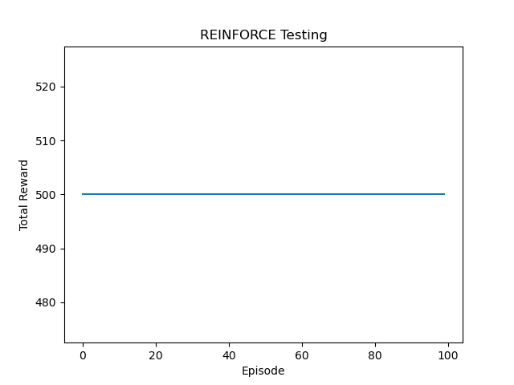

# **强化学习算法实践报告** 
> **姓名：** ***\
> **学号：112022*********\
> **教师：Li ChangSheng**\
> **课程：Thu 11-13**\
> **学期：2024-2025第一学期** \
> **算法实现**
> - [x] 蒙特卡洛策略评估（MC）
> - [x] 动态规划方法(DP)
> - [x] Sarsa算法
> - [x] Q学习(Q-Learning)
> - [x] 策略梯度（PG）
> - [x] 近端策略优化（PPO）
> - [x] 深度Q网络（DQN）
> - [x] 演员-评论家（A2C）

## 一、表格型方法

### 1. 蒙特卡洛策略评估（MC）
#### 原理

蒙特卡洛方法的核心思想是利用多次随机实验的结果来逼近某个目标函数的期望值。在强化学习问题上，蒙特卡洛方法通过观察完整的序列来估计动作值函数 ${ Q(s, a) }$或状态值函数 ${ V(s) }$。

#### 特点

- 无模型：不需要环境的模型知识，只需要通过采样进行评估。
- 大数定律：随着采样次数的增加，估计结果会收敛于真实值。
- 样本效率：对于非马尔可夫或复杂环境可能较低，因为有限样本数量下的估计可能不准确。


#### 实施步骤

以下是使用蒙特卡洛方法进行策略评估的基本步骤：

- 初始化：初始化状态值函数 ${ V(s) }$ ，或动作值函数 ${ Q(s, a) }$ 。
- 生成序列：
- 使用当前策略 ${ \pi }$ 生成一个完整的序列，直到达到终止状态。
- 记录在序列中每个状态、动作和奖励。
- 计算回报：
对于每个序列中的状态，计算从该状态以后获得的总回报 ${ G_t }$。
- 更新估计：
更新估计的值函数： ${ V(s) \leftarrow V(s) + \alpha (G_t - V(s)) }$，其中 ${\alpha}$ 是学习率。
- 重复：重复生成序列和更新步骤，直到值函数收敛。
#### 策略改进
一旦有了值函数的良好估计，策略也可以进行改进。通过以下步骤，实现策略改进：
对于贪心策略的选取：选择使动作值最大化的动作。
使用 ${ \epsilon }$-贪心法探索，以确保策略的持续改进： 
$${ \pi(a|s) = \begin{cases} 1 - \epsilon + \frac{\epsilon}{|\mathcal{A}(s)|} & \text{if } a = \arg\max_a Q(s, a) \\ \frac{\epsilon}{|\mathcal{A}(s)|} & \text{otherwise} \end{cases} }$$  
其中 ${ \epsilon }$ 是探索率。

#### 源代码
- 离散化： 对连续的状态空间进行离散化，以便于处理马尔可夫决策过程。其中离散化系数，也就是对连续区间进行等间距分隔的“箱子”个数num_bins作为训练时的超参数。
  ```python 
  def create_bins(num_bins, lower_bound, upper_bound):
    return np.linspace(lower_bound, upper_bound, num_bins)


  def discretize_state(state, cart_pos_bins, cart_vel_bins, pole_angle_bins, pole_vel_bins):
    cart_pos_idx = np.digitize(state[0], cart_pos_bins) - 1
    cart_vel_idx = np.digitize(state[1], cart_vel_bins) - 1
    pole_angle_idx = np.digitize(state[2], pole_angle_bins) - 1
    pole_vel_idx = np.digitize(state[3], pole_vel_bins) - 1
    return (cart_pos_idx, cart_vel_idx, pole_angle_idx, pole_vel_idx)
  ```
- 主学习函数
    - 状态空间离散化：首先通过 create_bins 分别将小车位置、速度、杆角度和杆速度离散化。
  - 初始Q表和返回计数：初始化 Q_table 用于存储状态动作值，returns_count 用于计算回报次数均值。
  - 每个episode的初始化：重置环境，清空当前episode的状态、动作和奖励。
  - 随机策略选择动作：在每步选择随机动作，并执行动作获得新状态和奖励，随后将其存储。
  - 计算蒙特卡洛回报 ${G}$ 并更新Q表：从后向前遍历每个episode's (状态, 动作)，计算累计折扣回报，更新Q值。
  ```python
  def monte_carlo_learning(env, num_episodes, num_bins, gamma=1.0):
    # 为CartPole特性创建bin
    cart_pos_bins = create_bins(num_bins, -2.4, 2.4)
    cart_vel_bins = create_bins(num_bins, -3.0, 3.0)
    pole_angle_bins = create_bins(num_bins, -0.5, 0.5)
    pole_vel_bins = create_bins(num_bins, -2.0, 2.0)

    # 初始化策略和Q-table
    action_space_size = env.action_space.n
    Q_table = np.zeros((num_bins, num_bins, num_bins, num_bins, action_space_size))
    returns_count = np.zeros((num_bins, num_bins, num_bins, num_bins, action_space_size))

    for episode in range(num_episodes):
        state = env.reset()
        episode_states_actions_rewards = []
        done = False

        while not done:
            state_discrete = discretize_state(state, cart_pos_bins, cart_vel_bins, pole_angle_bins, pole_vel_bins)
            action = np.random.choice(env.action_space.n)  # 随即选择动作

            # 执行动作，观察结果
            next_state, reward, done, _ = env.step(action)
            episode_states_actions_rewards.append((state_discrete, action, reward))
            state = next_state

        G = 0
        for state_discrete, action, reward in reversed(episode_states_actions_rewards):
            G = gamma * G + reward
            sa_pair = (*state_discrete, action)
            returns_count[sa_pair] += 1
            Q_table[sa_pair] += (G-Q_table[sa_pair]) / returns_count[sa_pair]

        if episode % 1000 == 0:
            print(f"Episode {episode} complete.")

    return Q_table
  ```
- 提取策略函数：从Q表中提取策略：对每个状态选择使Q值最大的动作。
  ```python
  def get_policy(Q_table):
    return np.argmax(Q_table, axis=-1)
  ```
- 测试函数
  ```python
  def test(env,policy,num_bins):
    state = env.reset()
    cart_pos_bins = create_bins(num_bins, -2.4, 2.4)
    cart_vel_bins = create_bins(num_bins, -3.0, 3.0)
    pole_angle_bins = create_bins(num_bins, -0.5, 0.5)
    pole_vel_bins = create_bins(num_bins, -2.0, 2.0)

    avg_reward = 0
    num_test_episodes = 100
    rewards = []
    for episode in range(num_test_episodes):
        state = env.reset()
        episode_reward = 0
        done = False
        while not done:
            state_discrete = discretize_state(state, cart_pos_bins, cart_vel_bins, pole_angle_bins, pole_vel_bins)
            action = policy[state_discrete]
            state, reward, done, _ = env.step(action)
            episode_reward += reward
        rewards.append(episode_reward)
        avg_reward += episode_reward
        if episode % 10 == 0:
            print(f"test: Episode {episode} reward: {episode_reward}")
    avg_reward /= num_test_episodes
    print(f"Average reward: {avg_reward}")
    return avg_reward, rewards
  ```

#### 参数实验
- 固定gamma，测试bin
  
  
  
  **可以发现，当gamma=1时，bins越大，即离散化程度越大，100次测试下平均奖励在逐渐变小**

- 固定bin，测试gamma
  
  

  **可以发现，当bin=5时，gamma取0.5、0.6为宜。**

#### 最终结果
- 当gamma=0.5，bin=5，train_episodes=6000时，结果如下：

  

  **平均奖励来到了487.53，基本接近于该环境的奖励上限。但是，在测试中，仍有不同程度的震荡，即不能更好的稳定在500左右。**
#### 结论
- 蒙特卡洛方法是一种无模型的强化学习方法，通过多次采样来估计值函数。
- 蒙特卡洛方法的优点是简单易懂，不需要环境模型，但需要大量的采样。
- 蒙特卡洛方法在实际问题中往往适用于小规模、有完整模型信息的问题。对于大型、复杂、模型不确定的问题，往往还需借助其他方法如近似动态规划或强化学习。

### 2.动态规划方法(DP)
#### 原理
动态规划（Dynamic Programming, DP）是一类用于解决复杂问题的优化算法，适用于可以分解为有重叠子问题的情形。它广泛用于各类最优化和决策问题中，尤其是在已知数学模型的强化学习中。DP通过系统地枚举所有可能状态和动作对，从已有信息中不断进行改进，最终逼近最优解。

#### 动态规划在强化学习中的应用
在强化学习中，DP方法通常用于求解马尔可夫决策过程（MDP）。它依赖于以下假设：

- 完全模型已知：知道所有状态转移概率 ${ P(s' | s, a) }$ 和相应的奖励函数 ${ R(s, a, s') }$。
- 有界状态空间和动作空间：通常需要有限数量的状态和动作以保证计算的可行性。
动态规划的基本原理
- 两个核心算法：策略迭代（Policy Iteration）和价值迭代（Value Iteration）。本次例子中使用的是价值迭代算法。

#### 价值迭代
- 价值迭代的核心公式：
基于贝尔曼最优方程，价值迭代不断更新每个状态的价值函数 ${ V(s) }$ ，以期望累积回报最大化为目标： ${ V(s) = \max_a \sum_{s'} P(s' | s, a) [R(s, a, s') + \gamma V(s') ]}$ 其中，${\gamma}$ 是折扣因子，用于平衡即期和远期奖励。
- 更新过程：
初始化状态值 ${ V(s) }$ 为零或任意猜测值。
对于每个状态 ${ s }$，计算在所有可能动作 ${ a }$ 的期望价值并选取最大者更新 ${ V(s) }$。
重复上述过程直到 ${ V(s) }$ 收敛于某一稳定值，即状态值变化成无动态改变（差值小于某阈值 ${\theta}$ 时停止）。
- 从价值函数提取策略：
一旦价值函数 ${V(s) }$ 收敛，通过选择在给定状态下使得价值函数达到最大值的动作提取最佳策略。

#### 动态规划的优点与缺点
- 优点：
  - 在已知模型时能够找到全局最优解。
  - 理论证明了收敛性和最优性。
- 缺点：
  - 需知道完整的环境模型，而这在实际问题中往往不可用。
  - 在状态空间和动作空间过大时，计算和存储负担极重（“维数灾难”）。
  - 在实践中，动态规划适用于小规模、有完整模型信息的问题。对于大型、复杂、模型不确定的问题，往往还需借助其他方法如近似动态规划或强化学习。

#### 源代码
- 离散化：跟上一个算法一样，这里略去。
  - Q表跟新：更新Q表的过程是通过迭代更新每个状态的价值函数，直到价值函数收敛。
    ```python
    def q_value_iteration(env, num_bins, gamma=1.0, theta=1e-5):
      cart_pos_bins = create_bins(num_bins, -2.4, 2.4)
      cart_vel_bins = create_bins(num_bins, -3.0, 3.0)
      pole_angle_bins = create_bins(num_bins, -0.5, 0.5)
      pole_vel_bins = create_bins(num_bins, -2.0, 2.0)

      action_space_size = env.action_space.n
      Q = np.zeros((num_bins, num_bins, num_bins, num_bins, action_space_size))
      i = 0
      while True:
          delta = 0
          print(f"Iteration{i}")
          for cart_pos_idx in range(num_bins):
              for cart_vel_idx in range(num_bins):
                  for pole_angle_idx in range(num_bins):
                      for pole_vel_idx in range(num_bins):
                          for action in range(action_space_size):
                              state_values = []
                              env.reset()
                              env.env.state = (cart_pos_bins[cart_pos_idx],
                                               cart_vel_bins[cart_vel_idx],
                                               pole_angle_bins[pole_angle_idx],
                                               pole_vel_bins[pole_vel_idx])
                              next_state, reward, done, _ = env.step(action)
                              if done:
                                  Q_value = reward
                              else:
                                  next_state_discrete = discretize_state(next_state, cart_pos_bins, cart_vel_bins,
                                                                         pole_angle_bins, pole_vel_bins)
                                  Q_value = reward + gamma * np.max(Q[next_state_discrete])

                              state_values.append(Q_value)

                              old_value = Q[cart_pos_idx, cart_vel_idx, pole_angle_idx, pole_vel_idx, action]
                              Q[cart_pos_idx, cart_vel_idx, pole_angle_idx, pole_vel_idx, action] = Q_value
                              delta = max(delta, np.abs(old_value - Q_value))

          if delta < theta:
              break
          else:
              print(f"iteration {i} complete,delta={delta}")
              i += 1

      policy = np.argmax(Q, axis=-1)
      return policy, Q
    ```
- 测试函数： 与上一个算法一样，这里略去。
- 参数实验：
 - 固定gamma，测试bin

   

   **可以发现，当gamma=0.5，theta=1e-10时，离散化系数为5最优**
 - 固定bin，测试gamma

   
   
  **可以发现，当bin=5，theta=1e-10时，gamma取0.8最优**

#### 最终结果
- 当gamma=0.8，bin=5，theta=1e-10时，结果如下：

  

  **可以看到效果并不理想。**
#### 反思
- 由于DP方法需要完整的环境模型,也就是完整的状态转移矩阵，而在实际问题中，这种情况往往不可用。因此，DP方法在实际问题中的应用受到了很大的限制。
- 在实际问题中，DP方法往往适用于小规模、有完整模型信息的问题。对于大型、复杂、模型不确定的问题，往往还需借助其他方法如近似动态规划或强化学习。

### 3. Sarsa算法
#### 原理
SARSA（State-Action-Reward-State-Action）是一种流行的强化学习算法，属于基于Q值的算法，用于解决马尔可夫决策过程（MDP）问题。它是一种在线、基于策略的学习算法，主要用于寻找状态-动作对的价值函数，从而帮助智能体在环境中学习最佳策略。

SARSA算法的基本原理如下：

- 初始化：初始化任意的Q值函数 ${ Q(s, a) }$，通常Q值表中的值可以设为零或小的随机数，初始化最初的状态。

- 选择策略：通过策略选择动作（例如 ε-greedy）。
  - ε-greedy策略：大部分时候选择当前已知Q值最大的动作（利用），并且以ε的概率随机选择一个动作（探索）。
  执行动作与观察：在状态 ${ s_t }$ 下执行动作 ${ a_t }$，观察获得的即时回报 ${ r_{t+1} }$ 以及下一个状态 ${ s_{t+1} }$。

- 选择下一个动作：根据策略选择下一个动作 ${ a_{t+1} }$ 在新状态 ${ s_{t+1} }$。

- 更新Q值：

  - 使用SARSA更新规则： 
  $${ Q(s_t, a_t) \leftarrow Q(s_t, a_t) + \alpha [r_{t+1} + \gamma Q(s_{t+1}, a_{t+1}) - Q(s_t, a_t)] }$$ 
  其中， ${\alpha}$ 是学习率,${0 < \alpha ≤ 1}$，${ \gamma }$ 是折扣因子,${0 ≤ \gamma ≤ 1}$。
  
- 更新状态和动作：将状态和动作更新为 ${ s_{t+1} }$ 和 ${ a_{t+1} }$。

- 重复过程：继续重复上述步骤直到达到终止条件（例如，达到指定的迭代次数或环境达到终止状态）。

SARSA是一种逐步更新的算法，与Q学习的最大区别在于SARSA是基于在线状态-动作对进行更新，因此会遵循智能体实际采取的动作序列，算是一种跟踪智能体策略的"在线"更新法。
#### 源代码
- 离散化：跟上一个算法一样，这里略去。
- 动作选择：选择动作的过程是通过策略选择动作，这里使用的是ε-greedy策略。
  ```python
  import numpy as np
  def choose_action(Q, state, epsilon):
    if np.random.random() < epsilon:
        return np.random.choice([0, 1])
    else:
        return np.argmax(Q[state])
  ```
- SARSA更新：更新Q值的过程是通过SARSA更新规则，即根据当前状态、动作、奖励、下一个状态和下一个动作更新Q值。
  ```python
  def sarsa(env, n_episodes, lr, gamma, epsilon, epsilon_decay, epsilon_min, number_of_bins):
    n_actions = env.action_space.n

    # Create bins for each dimension of the state space
    cart_pos_bins = create_bins(number_of_bins, -4.8, 4.8)
    cart_vel_bins = create_bins(number_of_bins, -3.5, 3.5)
    pole_angle_bins = create_bins(number_of_bins, -0.418, 0.418)
    pole_vel_bins = create_bins(number_of_bins, -3.5, 3.5)

    # Initialize Q-table
    q_table = np.zeros((number_of_bins, number_of_bins, number_of_bins, number_of_bins, n_actions))

    # Main SARSA loop
    for episode in range(n_episodes):
        state = discretize_state(env.reset(), cart_pos_bins, cart_vel_bins, pole_angle_bins, pole_vel_bins)
        done = False
        action = choose_action(state, q_table, n_actions, epsilon)

        while not done:
            next_state_raw, reward, done, _ = env.step(action)
            next_state = discretize_state(next_state_raw, cart_pos_bins, cart_vel_bins, pole_angle_bins, pole_vel_bins)
            next_action = choose_action(next_state, q_table, n_actions, epsilon)

            # Update Q-table
            td_target = reward + gamma * q_table[next_state][next_action] * (not done)
            td_error = td_target - q_table[state][action]
            q_table[state][action] += lr * td_error

            state = next_state
            action = next_action

        # Update epsilon
        epsilon = max(epsilon_min, epsilon * epsilon_decay)

        if (episode + 1) % 50 == 0:
            print(f'Episode: {episode + 1}, Epsilon: {epsilon:.3f}')

    return q_table
  ```
- 测试函数： 与上一个算法一样，这里略去。
  ```python
  def test(env, q_table, number_of_bins, n_episodes=1000):
    # Create bins for each dimension of the state space (should match training)
    cart_pos_bins = create_bins(number_of_bins, -4.8, 4.8)
    cart_vel_bins = create_bins(number_of_bins, -3.5, 3.5)
    pole_angle_bins = create_bins(number_of_bins, -0.418, 0.418)
    pole_vel_bins = create_bins(number_of_bins, -3.5, 3.5)

    total_rewards = []

    for _ in range(n_episodes):
        state = discretize_state(env.reset(), cart_pos_bins, cart_vel_bins, pole_angle_bins, pole_vel_bins)
        done = False
        total_reward = 0

        while not done:
            action = np.argmax(q_table[state])  # Select action with the highest Q value
            next_state_raw, reward, done, _ = env.step(action)
            next_state = discretize_state(next_state_raw, cart_pos_bins, cart_vel_bins, pole_angle_bins, pole_vel_bins)

            total_reward += reward
            state = next_state

        total_rewards.append(total_reward)

    average_reward = np.mean(total_rewards)
    print(f'Average reward over {n_episodes} episodes: {average_reward:.2f}')
    return average_reward, total_rewards
  ```
  
- 参数实验：
  -  学习率调整
  
        

        **可以看到，当学习率为0.3时，看似效果最好，但是反复实验之后，最佳学习率通常在0.2-0.3之间**
  - 折扣因子调整
  
    
    
    **可以看到，当折扣因子为0.8时，效果最好。**
  
    CartPole环境的目标是保持杆尽可能长时间地直立，这本质上是一个长期目标问题。高折扣因子让智能体更加重视通过多步行动来保持平衡，而不是仅仅关注短期的收益。 
    高折扣因子鼓励智能体最大化累积奖励，意味着它会努力保持杆的平衡以获得更多的未来回报。
    使用更高的折扣因子可以使策略更稳定，因为它促使智能体考虑未来多步的潜在影响，而不是过于注重当前的一步。
    在众多文献和实践中，CartPole通常使用接近1的折扣因子，这被认为在这种持续的平衡任务中表现良好。
  - 训练集数调整
          
     **在上述最佳参数的基础上**，为探究训练集数对实验结果的影响，我们选取了4000，5000，6000三个不同的训练集数进行实验。并将训练得到的策略和Q表格进行100次测试，并计算平均奖励。
   
    **episode=4000：**
   
      
  
    **episode=5000：**
   
      
  
    **episode=6000：**
  
      
#### 最终结果
  - **可以看到，在训练集数在4000-6000的范围里，平均奖励在300左右，峰值可以达到环境上界**
  - **在4000次训练中，结果比较集中在[350,500]的区间，但仍有部分样本结果在200以下**
  - **在5000次训练中，结果比较集中在[320,400]的区间内，体现了sarsa算法比较稳定的特点，但是没有能达到峰值的结果**
  - **在6000次训练中，结果比较集中在[300,500]的区间内，无论是稳定性还是平均结果都没有4000次和5000次优秀，说明可能Q表在训练到4000到
5000次时已达到收敛，但不一定能收敛到最佳的结果**

### 4. Q学习(Q-Learning)
#### 原理
Q学习是一种异策略（off-policy）算法。异策略在学习的过程中，有两种不同的策略：目标策略（target policy）和行为策略（behavior policy）。 目标策略是我们需要去学习的策略，一般用 ${π}$ 来表示。
目标策略就像是在后方指挥战术的一个军师，它可以根据自己的经验来学习最优的策略，不需要去和环境交互。 行为策略是探索环境的策略，一般用 
${μ}$ 来表示。行为策略可以大胆地去探索到所有可能的轨迹，采集轨迹，采集数据，然后把采集到的数据“喂”给目标策略学习。
在异策略学习的过程中，轨迹都是行为策略与环境交互产生的，产生这些轨迹后，我们使用这些轨迹来更新目标策略${π}$。
#### 实施步骤
- 初始化:
  - Q表格：初始化Q表格，其中包含所有状态-动作对的Q值（通常设为0）。
  - 超参数：学习率${α}$（通常0到1之间）、折扣因子${γ}$（通常0到1之间）、探索策略（如${ε}$-贪心策略）。

- 策略学习过程:
  - 循环:
    - 初始化环境并获取初始状态。
    - 根据策略（例如${ε}$-贪心）选择动作a。
    - 执行动作a，获得奖励r，并进入下一个状态s'。
    - 更新Q值： ${ Q(s, a) = Q(s, a) + \alpha \left[ r + \gamma \max_{a'} Q(s', a') - Q(s, a) \right] }$
    - 更新当前状态为下一个状态s'。
    - 如果达到终端状态，结束当前回合。
- 收敛与策略提取:
  - 随着迭代的进行，Q表中的值会逐渐逼近于最优Q值。
  - 每个状态的最优动作可以通过： ${ \pi(s) = \arg\max_{a} Q(s, a) }$
${[ \sum_{t=0}^{\infty} \alpha_t = \infty \quad \text{and} \quad \sum_{t=0}^{\infty} \alpha_t^2 < \infty ]}$

#### 源代码
- 离散化：跟上一个算法一样，这里略去。
- 动作选择：仍采用${/epsilon}$-greedy策略，与上一个算法一样，这里略去。
- Q-learning学习过程：
  ```python
  def train_q_learning(env, n_episodes=1000, alpha=0.1, gamma=0.99, epsilon=0.1, n_bins=(6, 6, 6, 6)):
    Q = defaultdict(lambda: np.zeros(env.action_space.n))
    reward_episodes = []
    loss_episodes = []
    for episode in range(n_episodes):
        state = env.reset()
        state = discretize_state(state, n_bins)
        total_reward = 0
        done = False
        losses = []
        while not done:
            # epsilon-greedy 策略选择动作
            action = choose_action(state, Q, epsilon, env.action_space.n)

            # 执行动作
            next_state, reward, done, _ = env.step(action)
            next_state = discretize_state(next_state, n_bins)
            total_reward += reward

            # 更新 Q 值
            if not done:
                best_next_action = np.argmax(Q[next_state])
                td_target = reward + gamma * Q[next_state][best_next_action]
            else:
                td_target = reward
            td_error = td_target - Q[state][action]
            losses.append(alpha*td_error)
            Q[state][action] += alpha * td_error

            # 移动到下一个状态
            state = next_state
        reward_episodes.append(total_reward)
        loss_episodes.append(max(losses))

        if episode % 100 == 0:
            print(f"Episode {episode}, Total Reward: {total_reward}")
    plt.plot(reward_episodes)
    plt.xlabel('Episode')
    plt.ylabel('Reward')
    plt.title('Q-learning Training')
    # plt.savefig('../Q-learning_results/Q-learning Training.png')
    plt.show()

    return Q
  ```
#### 训练集数调整
- 参数设置为，
  ```python
  n_episodes = 5000 # 训练次数
  alpha = 0.1  # 学习率
  gamma = 0.99 # 折扣因子
  epsilon = 0.1 # epsilon-greedy 策略参数
  num_bin = 6  # 状态空间离散化的分箱数
  n_bins = (num_bin, num_bin, num_bin, num_bin)
  ```
- 为探究训练集数对实验结果的影响，我们选取了4000，5000两个不同的训练集数进行实验。并将训练得到的策略和Q表格进行100次测试，并计算平均奖励。
   
  **episode=4000：**
   
    
    
  
  **episode=5000：**
   
    
    
#### 最终结果
- **可以看到，在训练集数在4000-5000的范围里，平均奖励在200左右，峰值可以达到环境上界**
- **4000或5000次训练，基本都以较快的速度上升，在1000-2000集时就可以达到峰值**
- **Q-learning收敛较快，但不如sarsa稳定，测试结果均方差较大**
- **Q-learning在训练集数较少时，效果较好，但在训练集数较多时，效果反而不如sarsa**

### 5. 总结
#### 1.MC，DP，TD的区别
自举是指更新时使用了估计。蒙特卡洛方法没有使用自举，因为它根据实际的回报进行更新。 动态规划方法和时序差分方法使用了自举。

采样是指更新时通过采样得到一个期望。 蒙特卡洛方法是纯采样的方法。 动态规划方法没有使用采样，它是直接用贝尔曼期望方程来更新状态价值的。 时序差分方法使用了采样。时序差分目标由两部分组成，一部分是采样，一部分是自举。

如果时序差分方法需要更广度的更新，就变成了 动态规划方法（因为动态规划方法是把所有状态都考虑进去来进行更新）。如果时序差分方法需要更深度的更新，就变成了蒙特卡洛方法。


#### 2.SARSA和Q-learning的区别
Sarsa 是一个典型的同策略算法，它只用了一个策略 π，它不仅使用策略 π 学习，还使用策略
π 与环境交互产生经验。 如果策略采用 ε-贪心算法，它需要兼顾探索，为了兼顾探索和利用，它训练的时候会显得有点“胆小”。它在解决悬崖行走问题的时候，会尽可能地远离悬崖边，确保哪怕自己不小心探索了一点儿，也还是在安全区域内。此外，因为采用的是
ε-贪心 算法，策略会不断改变（ ε 值会不断变小），所以策略不稳定。

Q学习是一个典型的异策略算法，它有两种策略————目标策略和行为策略，它分离了目标策略与行为策略。Q学习可以大胆地用行为策略探索得到的经验轨迹来优化目标策略，从而更有可能探索到最佳策略。行为策略可以采用 ε-贪心 算法，但目标策略采用的是贪心算法，它直接根据行为策略采集到的数据来采用最佳策略，所以 Q学习 不需要兼顾探索。

我们比较一下 Q学习 和 Sarsa 的更新公式，就可以发现 Sarsa 并没有选取最大值的最大化操作。因此，Q学习是一个非常激进的方法，它希望每一步都获得最大的利益；Sarsa 则相对较为保守，它会选择一条相对安全的迭代路线。

## 二、策略梯度方法
### 1.REINFORCE算法
#### 原理
REINFORCE是一种基于策略的强化学习算法，属于策略梯度方法。其主要思想是直接优化策略，使得累积的期望回报最大化。REINFORCE算法通过更新参数化策略来学习智能体的行为策略。以下是REINFORCE算法的基本原理：

- 策略参数化：假设策略是参数化的，记作 ${\pi(a|s; \theta)}$，这里 ${\pi}$ 是策略函数，${(a|s)}$ 是在状态 ${s}$ 下采取动作 ${a}$ 的概率，${\theta}$ 是策略的参数。

- 采样和回报：智能体根据当前策略与环境交互，采样出一个状态-动作序列，同时计算每个时间步之后的累计回报 ${G_t}$。

- 策略梯度：计算梯度 ${\nabla_\theta J(\theta)}$，以优化策略 ${\pi(a|s; \theta)}$ 以最大化期望回报。对于一个完整的轨迹 ${\tau = (s_0, a_0, r_1, s_1, a_1, r_2, \ldots )}$，梯度估计为：

  $${ \nabla_\theta J(\theta) = \mathbb{E}\tau [ \sum{t=0}^T \nabla_\theta \log \pi(a_t|s_t; \theta) G_t ] }$$

- 参数更新：通过梯度上升或下降，结合学习率 ${\alpha}$，逐步更新策略参数：

$${ \theta \leftarrow \theta + \alpha \nabla_\theta J(\theta) }$$

- 去偏估计：由于回报 ${G_t}$ 是一个有偏估计，可以减去一个基线 ${b(s)}$ 来降低方差而不改变梯度的期望，通常选择状态值函数 ${V(s_t)}$ 作为基线：

  $${ \nabla_\theta J(\theta) = \mathbb{E}\tau [ \sum{t=0}^T \nabla_\theta \log \pi(a_t|s_t; \theta) (G_t - b(s_t)) ] }$$

REINFORCE算法的优势在于其简单性和理论上可以收敛到全局最优策略的可能性，但由于回报的高方差，学习稳定性和效率可能较差，尤其是在复杂或连续状态空间的环境中。

#### 源代码
- 定义策略网络：定义一个简单的前馈神经网络作为策略网络，输入为状态，输出为动作的概率分布。分别用一层线性层作为输入层，ReLU激活函数，和输出层的Softmax激活函数。
  ```python
  import torch
  import torch.nn as nn
  
  class PolicyNetwork(nn.Module):
    def __init__(self, state_space, action_space):
        super(PolicyNetwork, self).__init__()
        self.fc = nn.Sequential(
            nn.Linear(state_space, 128),
            nn.ReLU(), # 使用ReLU激活函数，增加网络的非线性
            nn.Linear(128, action_space),
            nn.Softmax(dim=-1)
        )

    def forward(self, x):
        return self.fc(x)
  ```
- reinforce算法：迭代每个episode：重置环境以开始新的episode，初始化存储对数概率和奖励的列表。在一个episode内，不断采样动作，直至完成：
state转换为张量并增加维度。
policy_net(state)返回动作概率。
Categorical(probs)定义分类分布用于采样动作。
action是从该分布采样的动作。
log_prob是所选动作的对数概率。
在每个回合进行采样后，按照时间顺序逆序计算累积回报，并标准化。
再计算损失，将log_prob与标准化的回报相乘，然后取负值。
最后对损失进行反向传播，更新策略网络的参数。
  ```python
  import torch
  import torch.nn as nn
  import torch.optim as optim
  from torch.distributions import Categorical
  import matplotlib.pyplot as plt
  
  def reinforce(env, policy_net, optimizer, num_episodes=1000, gamma=0.99):
    reward_episode = []
    for episode in range(num_episodes):
        state = env.reset()
        log_probs = []
        rewards = []

        # 收集一条轨迹
        done = False
        while not done:
            state = torch.FloatTensor(state).unsqueeze(0)
            probs = policy_net(state) # 获取动作概率
            m = Categorical(probs)
            action = m.sample()
            log_prob = m.log_prob(action)

            new_state, reward, done, _ = env.step(action.item())

            log_probs.append(log_prob)
            rewards.append(reward)
            state = new_state

        # 计算返回（回报）和更新策略
        returns = []
        G = 0
        for r in reversed(rewards):
            G = r + gamma * G
            returns.insert(0, G)
        returns = torch.tensor(returns)

        # 标准化回报
        returns = (returns - returns.mean()) / (returns.std() + 1e-6)

        loss = []
        for log_prob, G in zip(log_probs, returns):
            loss.append(-log_prob * G)

        optimizer.zero_grad()
        loss = torch.cat(loss).sum()  # 将loss列表中的tensor拼接成一个tensor，然后求和
        loss.backward() # 反向传播
        optimizer.step() # 更新参数

        reward_episode.append(sum(rewards))

        # 打印进度
        if episode % 100 == 0:
            print(f'Episode {episode}/{num_episodes}, Total Reward: {sum(rewards)}')

    print('Training Complete!')
    plt.plot(reward_episode)
    plt.xlabel('Episode')
    plt.ylabel('Total Reward')
    plt.title('REINFORCE Training')
    plt.show()
    torch.save(policy_net.state_dict(), '../Policy/PG_policy_net.pth')
  ```
  最后，我们训练策略网络并保存模型参数。在训练过程中，我们可以看到每个episode的总奖励，以及训练完成后的总奖励曲线。

- 训练过程：
  ```python
  # 初始化环境
  env = gym.make('CartPole-v1')
  state_space = env.observation_space.shape[0]
  action_space = env.action_space.n

  # 创建策略网络和优化器
  policy_net = PolicyNetwork(state_space, action_space)
  optimizer = optim.Adam(policy_net.parameters(), lr=1e-2)

  # 运行REINFORCE算法
  reinforce(env, policy_net, optimizer)

  # 测试策略网络
  test_policy(env, policy_net)
  env.close()
  ```

#### 训练结果
- 训练结果如下：

  

  **可以看到，在训练100次左右首次达到峰值，最后在大约500次后收敛到500。**

- 测试结果如下：

    
    
    **可以看到，测试结果全部500，表现优秀。**

#### 总结
- REINFORCE算法是一种基于策略的强化学习算法，通过直接优化策略来最大化累积的期望回报。
- REINFORCE算法的优势在于其简单性和理论上可以收敛到全局最优策略的可能性，但由于回报的高方差，学习稳定性和效率可能较差，尤其是在复杂或连续状态空间的环境中。

### 2.PPO算法
#### 原理
近邻策略优化（Proximal Policy Optimization, PPO）是一种先进的强化学习算法，属于策略梯度方法。PPO方法引入了新的策略更新机制，用以平衡探索和收敛之间的矛盾，增强策略优化的稳定性和鲁棒性。其基本原理可以总结如下：

- 策略限制：
PPO在策略更新时引入了限制，确保新旧策略之间的更新幅度不会太大。这个限制通过设计目标函数中的剪切（clipping）来控制偏差，以防止策略过快变化导致不稳定。
- 目标函数：
PPO使用的是一个被称为剪切策略目标函数（Clipped Surrogate Objective）的函数形式：

  $${ L^{CLIP}(\theta) = \mathbb{E}_t \left[ \min\left( r_t(\theta) \hat{A}_t, \text{clip}(r_t(\theta), 1 - \epsilon, 1 + \epsilon) \hat{A}_t \right) \right] }$$

  其中，${ r_t(\theta) = \frac{\pi_\theta(a_t|s_t)}{\pi_{\theta_{old}}(a_t|s_t)} }$，表示新旧策略概率之比，${\hat{A}_t}$是优势估计，${\epsilon}$是超参数用于限制更新范围。

- 优势函数：
优势函数 ${\hat{A}_t}$ 标识了某动作在当前策略下优于均值策略的程度。优势估计可以用值函数近似，常使用广义优势估计（GAE, Generalized Advantage Estimation）方法:
  $${\hat{A}t = \delta_t + (\gamma \lambda) \delta{t+1} + (\gamma \lambda)^2 \delta_{t+2} + \cdots }$$

  其中，${\delta_t = r_t + \gamma V(s_{t+1}) - V(s_t)}$ 是TD误差。
- 神经网络参数化：
PPO通常使用两个神经网络，一个用于策略（Actor），另一个用于状态值函数（Critic）。这些网络通过交替优化更新。
- 交替更新：
PPO在同一批数据上进行多个epoch的策略更新，但每次更新都限制了策略的变化。这种方法能够在不增加环境交互采样次数的情况下，提高策略更新的样本效率。
易用性和鲁棒性：

相较于其他复杂的策略优化方法，PPO简单、易于实现，具有良好的稳定性和性能，在处理大规模任务时表现出色。
PPO流行的原因在于它兼顾了算法表现和实现复杂度，在多个连续控制和组合优化任务中表现优良，其策略更新机制为各种应用提供更可靠的优化策略。

#### 源代码
- 定义策略网络和价值网络，分别用于策略和状态值函数的参数化。
  ```python
  class PolicyNet(nn.Module):
    def __init__(self, state_dim, hidden_dim, action_dim):
        super().__init__()
        self.fc1 = nn.Linear(state_dim, hidden_dim)
        self.fc2 = nn.Linear(hidden_dim, action_dim)

    def forward(self, x):
        x = F.relu(self.fc1(x))
        return F.softmax(self.fc2(x), dim=1)


  class ValueNet(nn.Module):
    def __init__(self, state_dim, hidden_dim):
        super().__init__()
        self.fc1 = nn.Linear(state_dim, hidden_dim)
        self.fc2 = nn.Linear(hidden_dim, 1)

    def forward(self, x):
        x = F.relu(self.fc1(x))
        return self.fc2(x)
  ```
- PPO算法：定义PPO算法，包括策略更新、价值函数更新、优势估计、目标函数等。
  ```python
  class PPO:
    def __init__(self, state_dim, hidden_dim, action_dim, actor_lr, critic_lr, lmbda, epochs, eps, gamma, device):
        self.actor = PolicyNet(state_dim, hidden_dim, action_dim).to(device)
        self.critic = ValueNet(state_dim, hidden_dim).to(device)
        self.actor_optimizer = torch.optim.Adam(self.actor.parameters(), lr=actor_lr)
        self.critic_optimizer = torch.optim.Adam(self.critic.parameters(), lr=critic_lr)
        self.gamma = gamma
        self.lmbda = lmbda
        self.epochs = epochs    
        self.eps = eps  
        self.device = device

    def take_action(self, state): # 选择动作
        state = torch.FloatTensor([state]).to(self.device)
        probs = self.actor(state)
        action_dist = torch.distributions.Categorical(probs) # 定义分类分布
        action = action_dist.sample() # 采样动作
        return action.item()

    def gae(self, td_delta): # 计算广义优势估计
        td_delta = td_delta.detach().numpy() # 转换为numpy数组
        advantages_list = [] # 优势列表
        advantage = 0.0 # 优势
        for delta in td_delta[::-1]:
            advantage = self.gamma * self.lmbda * advantage + delta # 计算优势
            advantages_list.append(advantage)
        advantages_list.reverse() # 反转列表
        return torch.FloatTensor(advantages_list)

    def update(self, transition_dist): # 更新策略和价值网络
        states = torch.FloatTensor(transition_dist['states']).to(self.device)
        actions = torch.tensor(transition_dist['actions']).reshape((-1, 1)).to(self.device)
        rewards = torch.FloatTensor(transition_dist['rewards']).reshape((-1, 1)).to(self.device)
        next_states = torch.FloatTensor(transition_dist['next_states']).to(self.device)
        dones = torch.FloatTensor(transition_dist['dones']).reshape((-1, 1)).to(self.device)
        td_target = rewards + self.gamma * self.critic(next_states) * (1 - dones) # 计算TD目标
        td_delta = td_target - self.critic(states) # 计算TD误差
        # GAE 计算广义优势
        advantage = self.gae(td_delta.cpu()).to(self.device) 
        old_log_probs = torch.log(self.actor(states).gather(1, actions)).detach() # 旧的对数概率

        for _ in range(self.epochs):
            log_probs = torch.log(self.actor(states).gather(1, actions)) # 对数概率
            ration = torch.exp(log_probs - old_log_probs) # 比率
            surr1 = ration * advantage # 损失1
            surr2 = torch.clamp(ration, 1-self.eps, 1+self.eps) * advantage # 截断
            actor_loss = torch.mean(-torch.min(surr1, surr2))   # PPO损失函数
            critic_loss = torch.mean(F.mse_loss(self.critic(states), td_target.detach()))
            self.actor_optimizer.zero_grad()
            self.critic_optimizer.zero_grad()
            actor_loss.backward()
            critic_loss.backward()
            self.actor_optimizer.step()
            self.critic_optimizer.step()
    ```
- 训练过程：
    ```python
    # 初始化环境
  def train():
      actor_lr = 1e-3
      critic_lr = 1e-2
      num_episodes = 500
      hidden_dim = 128
      gamma = 0.98
      lmbda = 0.95
      epochs = 10
      eps = 0.2
      device = torch.device("cuda:0" if torch.cuda.is_available() else "cpu")
  
      env_name = "CartPole-v1"
      env = gym.make(env_name)
      torch.manual_seed(0)
      state_dim = env.observation_space.shape[0]
      action_dim = env.action_space.n
      agent = PPO(state_dim, hidden_dim, action_dim, actor_lr, critic_lr, lmbda, epochs, eps, gamma, device)
  
      return_list = []
      for i in range(10):
          with tqdm(total=int(num_episodes / 10), desc='Iteration %d' % i) as pbar:
              for i_episode in range(int(num_episodes / 10)):
                  episode_return = 0
                  transition_dict = {'states': [], 'actions': [], 'next_states': [], 'rewards': [], 'dones': []}
                  state= env.reset()
                  done = False
                  while not done:
                      action = agent.take_action(state)
                      next_state, reward, done,_= env.step(action)
                      # print(next_state, reward, done,truncated)
                      done = done    # 这个地方要注意
                      transition_dict['states'].append(state)
                      transition_dict['actions'].append(action)
                      transition_dict['next_states'].append(next_state)
                      transition_dict['rewards'].append(reward)
                      transition_dict['dones'].append(done)
                      state = next_state
                      episode_return += reward
                  return_list.append(episode_return)
                  agent.update(transition_dict)
                  if (i_episode + 1) % 10 == 0:
                      pbar.set_postfix({'episode': '%d' % (num_episodes / 10 * i + i_episode + 1),
                                        'return': '%.3f' % np.mean(return_list[-10:])})
                  pbar.update(1)
    ```
#### 训练结果
- 训练结果如下：

  

  **可以看到，在训练50次左右首次达到峰值，最后在大约500次后收敛到500。**

- 测试结果如下：

    
    
    **可以看到，测试结果全部500，表现优秀。**

#### 总结
- PPO算法是一种先进的策略梯度方法，通过引入策略限制和优势估计，提高了策略优化的稳定性和鲁棒性。
- PPO算法在处理大规模任务时表现出色，具有良好的稳定性和性能，易于实现和调整，适用于各种连续控制和组合优化任务。

## 三、深度学习方法
### 1.DQN算法
#### 原理
深度Q网络（Deep Q-Network, DQN）是结合经典Q学习和深度学习的强化学习算法，由DeepMind团队在2013年首次提出。DQN成功应用于复杂的视觉输入任务，并在很多情况下表现优异。以下是DQN的基本原理：

DQN算法基本原理

Q学习回顾：
Q学习是一种值迭代算法，它迭代更新 Q 值函数来估计在给定状态-动作对上的最优动作值。Q 值更新公式为： 

$${ Q(s, a) \leftarrow Q(s, a) + \alpha \left[ r + \gamma \max_{a'} Q(s', a') - Q(s, a) \right] }$$
重新定义动作的价值并更新Q表，直到收敛于真实的Q值。

引入神经网络逼近 Q 函数：
在DQN中，一个深度神经网络用于表示和逼近 Q 值函数。输入是状态，输出是对应动作的 Q 值。

经验回放 (Experience Replay)： 环境交互经验不再直接用于训练，而是存储在记忆库中。训练时随机采样小批量经验，这种方式解决了数据相关性和非平稳分布的问题，提高样本效率。

目标网络 (Target Network)： 为了避免网络更新不稳定的问题，DQN使用两个网络：
当前网络（用于选择动作并更新）
目标网络（用于计算目标Q值 ${y_t = r + \gamma \max_{a'} Q_{\text{target}}(s', a')}$）
目标网络在达到一定步数后从当前网络复制参数，以减缓目标值变化。

损失函数： 使用均方误差 (MSE) 损失来最小化误差： 
$${ L(\theta) = \mathbb{E}_{(s,a,r,s') \sim \mathcal{D}} \left[ \left( y_t - Q(s, a; \theta) \right)^2 \right] }$$
其中 ${y_t = r + \gamma \max_{a'} Q_{\text{target}}(s', a'; \theta^-) }$。

DQN的关键步骤

初始化：
初始化策略网络和目标网络参数。
初始化经验回放内存。

交互环境：
使用当前策略与环境交互，存储(state, action, reward, next_state, done)样本到记忆库。

从记忆库中采样经验：
随机抽取一个小批量样本用于训练。

计算目标 Q 值：
使用目标网络计算下一状态的最大 Q 值并更新目标值 ${y_t}$。

最小化损失：
使用反向传播算法更新策略网络参数。

更新目标网络：
以固定步数或者软更新策略更新目标网络参数。

DQN克服了传统Q学习在大型状态空间中的局限性，通过深度神经网络可以很好地处理高维输入并近似动作价值，从而被广泛用于复杂环境和任务中。

#### 源代码
- 定义Q网络，包括初始化网络结构和前向传播过程。
  ```python
  class QNetwork(nn.Module):
    def __init__(self, state_dim, hidden_dim, action_dim):
        super(QNetwork, self).__init__()
        self.fc1 = nn.Linear(state_dim, hidden_dim)
        self.fc2 = nn.Linear(hidden_dim, action_dim)

    def forward(self, x):
        x = F.relu(self.fc1(x))
        return self.fc2(x)
  ```
- 定义DQN算法，包括初始化网络、目标网络、优化器、经验回放等。
  ```python
  class DQN:
    def __init__(self, state_dim, hidden_dim, action_dim, lr, gamma, eps_start, eps_end, eps_decay, target_update,
                 memory_capacity, batch_size, device):
        self.q_network = QNetwork(state_dim, hidden_dim, action_dim).to(device)
        self.target_network = QNetwork(state_dim, hidden_dim, action_dim).to(device)
        self.target_network.load_state_dict(self.q_network.state_dict())
        self.optimizer = torch.optim.Adam(self.q_network.parameters(), lr=lr)
        self.gamma = gamma
        self.eps_start = eps_start
        self.eps_end = eps_end
        self.eps_decay = eps_decay
        self.epsilon = self.eps_start
        self.target_update = target_update
        self.memory = deque(maxlen=memory_capacity)
        self.batch_size = batch_size
        self.device = device
        self.action_dim = action_dim

    def select_action(self, state):
        if random.random() > self.epsilon:
            with torch.no_grad():
                state = torch.FloatTensor(state).to(self.device).unsqueeze(0)
                q_values = self.q_network(state)
                return q_values.max(1)[1].item()
        else:
            return random.randrange(self.action_dim)

    def store_transition(self, state, action, reward, next_state, done):
        self.memory.append((state, action, reward, next_state, done))

    def update(self, step):
        if len(self.memory) < self.batch_size:
            return

        batch = random.sample(self.memory, self.batch_size)
        states, actions, rewards, next_states, dones = zip(*batch)
        states = torch.FloatTensor(states).to(self.device)
        actions = torch.LongTensor(actions).unsqueeze(1).to(self.device)
        rewards = torch.FloatTensor(rewards).unsqueeze(1).to(self.device)
        next_states = torch.FloatTensor(next_states).to(self.device)
        dones = torch.FloatTensor(dones).unsqueeze(1).to(self.device)

        curr_q_values = self.q_network(states).gather(1, actions)
        next_q_values = self.target_network(next_states).max(1)[0].detach().unsqueeze(1)
        expected_q_values = rewards + self.gamma * next_q_values * (1 - dones)

        loss = F.mse_loss(curr_q_values, expected_q_values)

        self.optimizer.zero_grad()
        loss.backward()
        self.optimizer.step()

        self.epsilon = max(self.eps_end, self.eps_start - step / self.eps_decay)

        if step % self.target_update == 0:
            self.target_network.load_state_dict(self.q_network.state_dict())
    ```  
  
- 训练过程：
  ```python
  def train():
      lr = 1e-3
      num_episodes = 250
      hidden_dim = 128
      gamma = 0.98
      eps_start = 0.9
      eps_end = 0.05
      eps_decay = 500
      target_update = 10
      memory_capacity = 10000
      batch_size = 64
      device = torch.device("cuda:0" if torch.cuda.is_available() else "cpu")

      env_name = "CartPole-v1"
      env = gym.make(env_name)
      torch.manual_seed(0)
      state_dim = env.observation_space.shape[0]
      action_dim = env.action_space.n

      agent = DQN(state_dim, hidden_dim, action_dim, lr, gamma, eps_start, eps_end, eps_decay, target_update,
                  memory_capacity, batch_size, device)

      return_list = []
      step = 0

      for i in range(10):
          with tqdm(total=int(num_episodes / 10), desc='Iteration %d' % i) as pbar:
              for i_episode in range(int(num_episodes / 10)):
                  episode_return = 0
                  state = env.reset()
                  done = False
                  while not done:
                      action = agent.select_action(state)
                      next_state, reward, done, _ = env.step(action)
                      agent.store_transition(state, action, reward, next_state, done)
                      agent.update(step)
                      step += 1
                      state = next_state
                      episode_return += reward
                  return_list.append(episode_return)

                  if (i_episode + 1) % 10 == 0:
                      pbar.set_postfix({'episode': '%d' % (num_episodes / 10 * i + i_episode + 1),
                                        'return': '%.3f' % np.mean(return_list[-10:])})
                      if np.mean(return_list[-10:]) > 490:
                          torch.save(agent.q_network.state_dict(), '../Policy/DQN_net_peak.pth')
                  pbar.update(1)
  ```
- 测试过程：
    ```python
  def test():
        env_name = "CartPole-v1"
        env = gym.make(env_name)
        state_dim = env.observation_space.shape[0]
        action_dim = env.action_space.n
        hidden_dim = 128
        device = torch.device("cuda:0" if torch.cuda.is_available() else "cpu")

        agent = DQN(state_dim, hidden_dim, action_dim, 0, 0, 0, 0, 0, 0, 0, 0, device)
        agent.q_network.load_state_dict(torch.load('../Policy/DQN_net.pth'))
        agent.q_network.eval()

        num_episodes = 100
        return_list = []

        for i_episode in range(num_episodes):
            episode_return = 0
            state = env.reset()
            done = False
            while not done:
                action = agent.select_action(state)
                next_state, reward, done, _ = env.step(action)
                state = next_state
                episode_return += reward
            return_list.append(episode_return)
            print(f'Episode {i_episode}/{num_episodes}, Total Reward: {episode_return}') if i_episode % 10 == 0 else None

        episodes_list = list(range(len(return_list)))
        env.close()

    ```
  
#### 训练结果 
- 训练结果如下：

  

  **可以看到，在训练100次左右首次达到峰值，但是并没有始终没有达到完美收敛。**

- 测试结果如下：

    
    
    **可以看到，测试结果全部500，表现优秀。**

#### 总结
- DQN在训练过程中稳定性表现不如PPO和REINFORCE，QN的训练稳定性依赖于几个因素包括经验回放的效果和目标网络的更新。可能会受到训练不稳定的影响，尤其是在处理高维或者连续状态空间时。
- DQN本质上是服务于离散动作空间的，因此在连续动作空间上的表现不如PPO和REINFORCE。
- DQN在收敛过程中依赖于经验回放和目标网络，因此需要更多的训练时间和样本。

### 2.A2C算法
#### 原理
A2C（Advantage Actor-Critic）是改进的Actor-Critic算法的一种同步版本，主要用于解决策略优化问题。A2C的基本思路是利用“优势函数”（Advantage Function）来减少策略梯度的方差，并通过同步多个环境来提高优化效率。这里是A2C算法的基本原理和实现步骤：

基本原理：

Actor-Critic架构：
Actor：负责策略的更新。通过策略网络直接输出动作的概率分布，从而决定动作。
Critic：评估当前策略的好坏。通过价值网络（或Critic网络）输出状态值函数，用来指引Actor的学习。
优势函数（Advantage Function）：

优势函数用来衡量某个动作相对于当前策略下平均动作的好坏程度。定义为： ${ A(s, a) = Q(s, a) - V(s) }$
通过减少策略梯度的方差，提高学习效率。

异步 & 同步机制： A2C是同步的版本，采用多个环境并行运行，从中收集样本，通过平均梯度的方式来更新网络参数，这样可以提高样本效率和收敛速度。

实现步骤：

初始化策略网络和价值网络：两个网络共用一些层（特征共享部分），输出动作分布和状态值。

同步环境：初始化多个环境实例以并行运行。

并行采样：
在多个环境中同步采集样本：状态、动作、奖励和下一状态。
采用固定步数或一个完整的episode结束后更新参数。

计算奖励折现和优势值：
使用折扣因子γ累积未来的奖励并计算优势值： ${ R_t = r_t + \gamma V(s_{t+1}) }$,${ A(s, a) = r + \gamma V(s_{t+1}) - V(s_t) }$
计算损失函数：
策略损失 (使用优势值)： ${ L_{policy} = -\log \pi(a|s) \cdot A(s, a) }$
价值损失： ${ L_{value} = (R - V(s))^2 }$
熵损失（用于改善探索）： ${ L_{entropy} = \sum \pi(a|s) \log \pi(a|s) }$
总损失计算： ${ L = L_{policy} + c_1 \cdot L_{value} - c_2 \cdot L_{entropy} }$

反向传播和更新网络参数：
计算梯度并更新策略网络和价值网络的参数。

重复：
返回步骤3，继续采样和更新网络，直到达到终止条件（例如，设置的最大迭代次数或达到满意的性能）。
通过这些步骤，A2C能够有效地学习策略，在不同的环境中表现出良好的性能。A2C特别适合需要快速收敛的任务，因为它能够利用并行性提高训练效率。

#### 源代码
- 定义策略网络和价值网络，包括初始化网络结构和前向传播过程。
  ```python
  class PolicyNet(nn.Module):
    def __init__(self, state_dim, hidden_dim, action_dim):
        super().__init__()
        self.fc1 = nn.Linear(state_dim, hidden_dim)
        self.fc2 = nn.Linear(hidden_dim, action_dim)

    def forward(self, x):
        x = F.relu(self.fc1(x))
        return F.softmax(self.fc2(x), dim=1)


  class ValueNet(nn.Module):
    def __init__(self, state_dim, hidden_dim):
        super().__init__()
        self.fc1 = nn.Linear(state_dim, hidden_dim)
        self.fc2 = nn.Linear(hidden_dim, 1)
        
    def forward(self, x):
        x = F.relu(self.fc1(x))
        return self.fc2(x)
  ```
- 定义A2C算法，包括初始化网络、优化器、损失函数、采样和更新等。
  ```python
  class A2C:
    def __init__(self, state_dim, hidden_dim, action_dim, actor_lr, critic_lr, gamma, device):
        self.actor = PolicyNet(state_dim, hidden_dim, action_dim).to(device)
        self.critic = ValueNet(state_dim, hidden_dim).to(device)
        self.actor_optimizer = torch.optim.Adam(self.actor.parameters(), lr=actor_lr)
        self.critic_optimizer = torch.optim.Adam(self.critic.parameters(), lr=critic_lr)
        self.gamma = gamma
        self.device = device

    def take_action(self, state):
        state = torch.FloatTensor([state]).to(self.device)
        probs = self.actor(state)
        action_dist = torch.distributions.Categorical(probs)
        action = action_dist.sample()
        return action.item()

    def update(self, transition_dict):
        states = torch.FloatTensor(transition_dict['states']).to(self.device)
        actions = torch.tensor(transition_dict['actions']).reshape((-1, 1)).to(self.device)
        rewards = torch.FloatTensor(transition_dict['rewards']).reshape((-1, 1)).to(self.device)
        next_states = torch.FloatTensor(transition_dict['next_states']).to(self.device)
        dones = torch.FloatTensor(transition_dict['dones']).reshape((-1, 1)).to(self.device)

        # Compute TD target
        td_target = rewards + self.gamma * self.critic(next_states) * (1 - dones)
        td_delta = td_target - self.critic(states)

        # Actor Loss
        log_probs = torch.log(self.actor(states).gather(1, actions))
        actor_loss = -(log_probs * td_delta.detach()).mean()

        # Critic Loss
        critic_loss = F.mse_loss(self.critic(states), td_target.detach())

        # Update Actor Network
        self.actor_optimizer.zero_grad()
        actor_loss.backward()
        self.actor_optimizer.step()

        # Update Critic Network
        self.critic_optimizer.zero_grad()
        critic_loss.backward()
        self.critic_optimizer.step()
  ```
  
- 训练过程：
  ```python
  def train():
    actor_lr = 1e-3
    critic_lr = 1e-2
    num_episodes = 1000
    hidden_dim = 128
    gamma = 0.98
    device = torch.device("cuda:0" if torch.cuda.is_available() else "cpu")
    env_name = "CartPole-v1"
    env = gym.make(env_name)
    torch.manual_seed(0)
    state_dim = env.observation_space.shape[0]
    action_dim = env.action_space.n

    agent = A2C(state_dim, hidden_dim, action_dim, actor_lr, critic_lr, gamma, device)
    return_list = []

    for i in range(10):
        with tqdm(total=int(num_episodes / 10), desc='Iteration %d' % i) as pbar:
            for i_episode in range(int(num_episodes / 10)):
                episode_return = 0
                transition_dict = {'states': [], 'actions': [], 'next_states': [], 'rewards': [], 'dones': []}
                state = env.reset()
                done = False
                while not done:
                    action = agent.take_action(state)
                    next_state, reward, done, _ = env.step(action)
                    transition_dict['states'].append(state)
                    transition_dict['actions'].append(action)
                    transition_dict['next_states'].append(next_state)
                    transition_dict['rewards'].append(reward)
                    transition_dict['dones'].append(done)
                    state = next_state
                    episode_return += reward
                return_list.append(episode_return)
                agent.update(transition_dict)
                if (i_episode + 1) % 10 == 0:
                    pbar.set_postfix({'episode': '%d' % (num_episodes / 10 * i + i_episode + 1),
                                      'return': '%.3f' % np.mean(return_list[-10:])})
                pbar.update(1)

    env.close()
  ```
- 测试过程：
  ```python
  def test():
    num_episodes = 100
    env_name = "CartPole-v1"
    env = gym.make(env_name)
    state_dim = env.observation_space.shape[0]
    action_dim = env.action_space.n
    hidden_dim = 128
    device = torch.device("cuda:0" if torch.cuda.is_available() else "cpu")

    agent = A2C(state_dim, hidden_dim, action_dim, 0, 0, 0, device)
    agent.actor.load_state_dict(torch.load('../Policy/A2C_actor.pth'))
    agent.critic.load_state_dict(torch.load('../Policy/A2C_critic.pth'))
    agent.actor.eval()
    agent.critic.eval()

    return_list = []
    for i in range(num_episodes):
        episode_return = 0
        state = env.reset()
        done = False
        while not done:
            action = agent.take_action(state)
            state, reward, done, _ = env.step(action)
            episode_return += reward
        return_list.append(episode_return)
        print(f'Episode {i + 1} Return: {episode_return}') if (i + 1) % 10 == 0 else None

    average_return = np.mean(return_list)
    print(f'Average Return: {average_return}')

    plt.plot(range(len(return_list)), return_list)
    plt.xlabel('Episodes')
    plt.ylabel('Returns')
    plt.title(f'A2C on {env_name}, Average Return: {average_return}')
    plt.savefig('../A2C_results/A2C_testing.png')
    plt.show()

    env.close()
  ```
  
#### 训练结果
- 训练结果如下：

  

  **可以看到，在训练300次左右首次达到峰值，最后在大约500次后收敛到500。**
- 测试结果如下：

    
    
    **可以看到，测试结果平均返回结果达到497.52，表现优秀。个别episode会突然下降。**

#### 总结
注意到，A2C的收敛速度不如PPO和REINFORCE。但收敛效果和稳定性都比DQN好。A2C在处理连续动作空间和高维状态空间时表现优秀，适用于多种连续控制和组合优化任务。